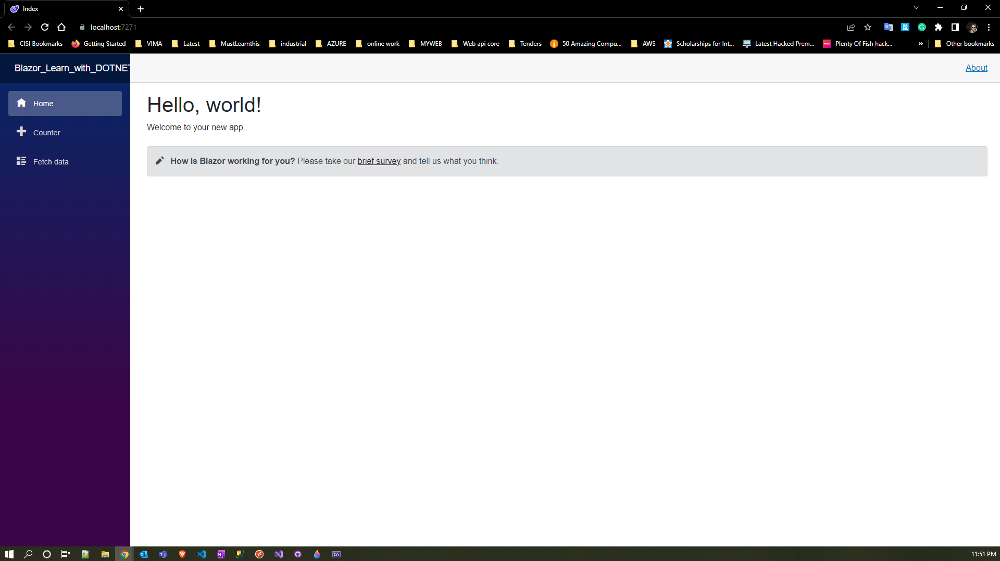

# Develop a Web App with Blazor in .NET 7

## Prerequisites
Before jumping into Blazor applications, we need the following perquisites.
* Visual Studio 2022 (or Visual Studio Code)
* NET 7 SDK
* C# knowledge

## Build a Web App with Blazor Server
Blazor server runs as an implementation of server side as a part of ASP.NET core app where UI events, button clicks, UI updates and interactions are communicated over SignalR connection. In this approach, the UI is generated on a web server and is transmitted to the visitor’s browser upon request. This two-way interaction occurs using SignalR and a web sockets connection. Any change in DOM content is generated from web server and update in automatically via SignalR with Blazor Server framework. This Blazor type has direct access to server and network resources since app is executed in server side.

We will open Visual Studio and create a new project as shown:

To develop Blazor server application, we will choose Blazor server app template and proceed to next. We will give a project name and location.

In the next screen, we will get an option to choose .Net framework, Authentication type and a couple options for the project.

After installation of .NET 7 SDK, we will have an option to choose .NET 7 in the framework. We will select .NET 7 framework and proceed. To keep it simple, we will keep other options default.

We have successfully created a Blazor server web application, and the project structure as shown.

his is how we can use server-side code in Blazor server. We have full access to the server side from the Blazor page and can interact with data or databases.

Let’s build and run the solution. 

